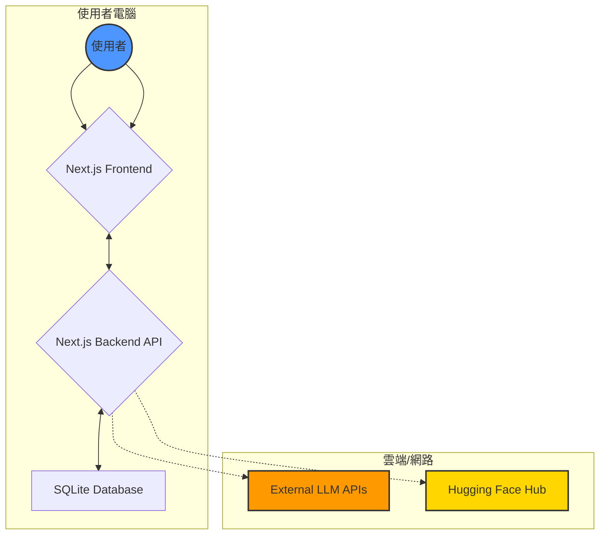

# Easy-Dataset 專案說明文件

本文檔旨在詳細說明 Easy-Dataset 專案的核心功能、使用方法、技術架構及應用潛力，目標讀者為對人工智慧和軟體開發有初步興趣的中學生。

---

### 1. 本專案用途是什麼? 核心功能是什麼? 實際應用場景是什麼?

#### 專案用途

想像一下，你想教一位只會說通用語言的 AI 成為某個特定領域的專家，比如「三國歷史」或「手機維修」。這個 AI 需要一本專為它設計的「教科書」，裡面充滿了該領域的知識問答。**Easy-Dataset** 就是一個能幫助你快速製作這種 AI 教科書的強大工具。

它的核心目標是：讓任何人都能輕鬆地將自己擁有的專業文件（如 PDF、Word 文件、Markdown 筆記）轉換成高品質的「微調資料集」(Fine-tuning Dataset)，也就是前面提到的 AI 教科書。

#### 核心功能

1.  **文件處理**：你可以上傳各種格式的檔案（如 `.pdf`, `.docx`, `.txt`），工具會自動讀取並整理內容。
2.  **智慧文本分割**：它會像切蛋糕一樣，將長篇大論的文件自動切成一個個獨立、有意義的「知識塊」。
3.  **AI 生成問題**：工具會驅動大型語言模型 (LLM)，針對每一個知識塊，自動提出相關的問題。
4.  **AI 生成答案**：接著，它會再次使用 LLM，為剛剛生成的問題提供詳盡的答案，並附上「思維鏈」(Chain of Thought, COT)，解釋它是如何思考得出答案的。
5.  **編輯與優化**：你可以隨時修改 AI 生成的問題和答案，確保內容的準確性。
6.  **格式化匯出**：最後，它會將這些高品質的問答對打包成 AI 模型能直接讀取的標準格式（如 Alpaca、ShareGPT），讓你隨時可以用來訓練自己的專家 AI。

#### 實際應用場景

*   **打造一個歷史通 AI**：一位歷史老師可以上傳他的「羅馬帝國」課程教案。Easy-Dataset 會自動生成像「凱撒大帝是誰？」、「羅馬競技場的用途是什麼？」等上百個問答。老師再用這份資料集去微調一個通用 AI，最終得到一個專門回答羅馬歷史問題的 AI 助教。
*   **企業內部知識庫**：一家公司可以上傳所有的產品說明書和維修手冊，製作一份客服專用的資料集。這樣訓練出來的 AI 客服，就能快速、準確地回答客戶關於產品的各種問題。

---

### 2. 本專案的 input/output 分別是什麼?

#### 輸入 (Input)

專案的主要輸入是包含特定領域知識的**文件**。你可以把它們想像成製作教科書的「原料」。

*   **支援的檔案格式**：
    *   `.pdf` (Adobe PDF 文件)
    *   `.docx` (Microsoft Word 文件)
    *   `.txt` (純文字檔案)
    *   `.md` (Markdown 格式文件)
    *   `.epub` (電子書格式)
*   **用途**：這些文件是知識的來源。專案會讀取其內容，並以此為基礎生成問答資料。

#### 輸出 (Output)

專案的最終產出是結構化的**微調資料集**。你可以把它看作是已經排版完成、可供 AI 直接學習的「教科書」。

*   **檔案格式**：
    *   `JSON`：一種通用的資料交換格式，易於閱讀和處理。
    *   `JSONL` (JSON Lines)：每一行都是一個獨立的 JSON 物件，適合處理非常大的資料集。
*   **資料結構格式**：
    *   **Alpaca 格式**：一種常用於指令微調的格式，通常包含 `instruction` (指令/問題) 和 `output` (輸出/答案)。
    *   **ShareGPT 格式**：常用於分享多輪對話內容的格式。
    *   **自定義格式**：你可以自己決定問答的欄位名稱。
*   **用途**：這些產出的檔案可以直接被 LLaMA Factory、Hugging Face 等主流 AI 模型訓練框架使用，來微調（訓練）你的專屬大型語言模型。

---

### 3. 本專案用到那些 LLM ? 分別使用在哪裡?

本專案巧妙地在多個環節利用大型語言模型 (LLM) 來自動化資料集的創建過程。它本身不限定特定的 LLM，而是設計成一個靈活的客戶端，**可以接入任何與 OpenAI API 格式相容的 LLM**，例如 OpenAI 的 GPT 系列、Ollama 部署的本地模型、智譜 AI 等。

LLM 主要應用在以下三個地方：

1.  **生成問題 (Question Generation)**
    *   **在哪裡使用**：「蒸餾 (Distill)」功能區。當你提供一個知識主題（例如「太陽系」）後，工具會觸發此流程。
    *   **LLM 做什麼**：工具會向 LLM 發出一個指令，例如：「請基於『太陽系』這個主題，生成 5 個相關的問題。」
    *   **產生結果**：LLM 會回傳一個 JSON 格式的答案，裡面包含了它生成的問題列表。例如：`["太陽系中最大的行星是什麼？", "什麼是小行星帶？"]`。

2.  **生成答案 (Answer Generation)**
    *   **在哪裡使用**：「問題 (Questions)」列表頁。當你為某個問題點擊「生成答案」圖示時觸發。
    *   **LLM 做什麼**：工具會將問題以及相關的原文「知識塊」一起發送給 LLM，並指令它：「請根據以下內容，回答這個問題，並提供你的思考步驟。」
    *   **產生結果**：LLM 會回傳一個包含兩部分的結果：
        *   **答案 (Answer)**：對問題的直接回答。例如：「太陽系中最大的行星是木星。」
        *   **思維鏈 (Chain of Thought, COT)**：解釋它如何得到答案的思考過程。例如：「1. 回憶太陽系中的八大行星。2. 比較它們的體積和質量。3. 確認木星是最大的。」

3.  **優化思維鏈 (COT Optimization)**
    *   **在哪裡使用**：在生成答案後，由系統自動在後台觸發。
    *   **LLM 做什麼**：工具會將已經生成的問題、答案和初步的思維鏈再次發送給 LLM，並指令它：「請優化這段思維鏈，讓它更有邏輯、更清晰。」
    *   **產生結果**：LLM 會回傳一段經過潤色的、更高品質的思維鏈。

---

### 4. 調整配置參數會有哪些影響?

本專案的參數配置分為三類，它們共同決定了應用的行為和產出品質。

1.  **模型設定 (Model Settings)**
    *   **在哪裡調整**：UI 介面的「設定」->「模型設定」。
    *   **重要參數**：
        *   `API Key` / `Endpoint`：你的 LLM 服務憑證和 API 地址。**這是最重要的設定，如果填錯，所有 AI 生成功能都會失敗。**
        *   `Temperature` (溫度)：控制 AI 回答的「創造性」。數值越高 (如 0.8)，答案越隨機、有創意；數值越低 (如 0.2)，答案越固定、精確。
        *   `Max Tokens` (最大權杖數)：限制 AI 單次回應的長度。如果太小，可能會導致答案或思維鏈不完整。
    *   **影響**：直接決定了內容生成的核心——由哪個模型生成、生成內容的風格以及成本。

2.  **任務設定 (Task Settings)**
    *   **在哪裡調整**：UI 介面的「設定」->「任務設定」。
    *   **重要參數**：
        *   `textSplit...` (文本分割長度)：控制知識塊的大小。如果切得太細，可能導致問題過於零碎，缺乏上下文；如果切得太粗，又可能讓 AI 難以聚焦。
        *   `concurrencyLimit` (並行限制)：設定同時向 LLM API 發送請求的數量。調高可以加快批次處理速度，但也更容易觸發 API 的頻率限制或導致費用暴增。
        *   `multiTurn...` (多輪對話設定)：定義了生成對話資料集時的角色、場景和對話輪數，直接影響對話式資料集的風格和內容。
    *   **影響**：主要影響資料處理的效率和產出資料集的顆粒度與風格。

3.  **環境變數 (.env 檔案)**
    *   **在哪裡調整**：專案根目錄下的 `.env` 檔案 (若存在)。
    *   **重要參數**：
        *   `DATABASE_URL`：指定應用程式本地 SQLite 資料庫檔案的路徑。修改它會讓應用程式讀取或儲存到一個全新的資料庫。
    *   **影響**：主要用於開發和部署時的底層環境配置，普通使用者通常不需要修改。

---

### 5. 系統架構與完整執行過程

#### 系統架構

本專案採用了現代化的桌面應用程式架構，主要分為以下幾個層次：

*   **使用者介面 (Frontend)**：基於 **Next.js** 和 **React** 開發的單頁應用，為使用者提供所有可視化操作介面。
*   **本地後端 (Backend)**：利用 Next.js 的 **API Routes** 功能，在本地運行一個輕量級後端伺服器。它負責處理前端的請求，操作本地資料庫，並作為代理去呼叫外部的 LLM API。
*   **桌面應用包裝 (Electron Wrapper)**：整個 Next.js 應用被 **Electron** 打包成一個獨立的桌面應用程式（`.exe`, `.dmg`），使其可以在 Windows, macOS, Linux 上直接運行，無需依賴瀏覽器。
*   **本地資料庫 (Database)**：使用 **SQLite** 這種輕量級的檔案型資料庫，透過 **Prisma** ORM 進行操作。所有專案、設定、資料集都儲存在本地的一個檔案中。
*   **外部服務 (External Services)**：
    *   **LLM APIs**：如 OpenAI, Google Gemini, Ollama 等，是內容生成的「大腦」。
    *   **Hugging Face Hub**：一個 AI 社區和模型託管平台，專案支援將產出的資料集一鍵上傳到這裡。

#### 完整執行過程

一位使用者從零開始創建一個專家 AI 資料集的完整步驟如下：

1.  **啟動與設定**：打開 Easy-Dataset 桌面應用。進入「設定」頁面，填寫自己購買或部署的 LLM API Key 和 Endpoint。
2.  **建立專案**：在首頁點擊「創建專案」，為自己的「羅馬歷史」資料集專案命名。
3.  **提供原料**：進入專案後，點擊「文本分割」，將寫好的 `羅馬歷史.pdf` 文件拖拽進上傳區。
4.  **自動切塊**：系統自動將 PDF 內容分割成數十個長度適中的文本塊（Chunk），並在介面上展示出來。
5.  **AI 提問題**：使用者切換到「蒸餾」頁面，點擊「生成問題」按鈕。系統驅動 LLM 閱讀文本塊，生成一批相關問題，如「羅馬共和國是何時建立的？」。
6.  **AI 給答案**：使用者切換到「問題」頁面，看到所有生成的問題列表。他可以點擊每個問題旁邊的「生成答案」圖示。系統會再次驅動 LLM，基於原文內容生成答案和思維鏈。
7.  **審核與匯出**：使用者在「資料集」頁面逐一檢查問答對，修正錯漏。確認無誤後，點擊「匯出」，選擇 `Alpaca` 格式和 `JSONL` 檔案類型，將資料集儲存到本地。
8.  **模型微調**：使用者將匯出的 `dataset.jsonl` 檔案用於 AI 模型微調框架，最終得到一個專屬於他的「羅馬歷史專家 AI」。

---

### 6. 本專案在公司內部有哪些應用方向?

Easy-Dataset 對於任何希望利用內部私有知識來增強 AI 能力的公司來說，都具有極高的價值。

*   **智慧客服與技術支援**：
    *   **應用**：上傳所有產品手冊、技術規格書、過往客服問答記錄。
    *   **效果**：訓練出一個能 24/7 自動回答客戶技術問題、指導使用者操作的 AI 客服，大幅降低人力成本，提升客戶滿意度。

*   **新員工入職培訓**：
    *   **應用**：將公司內部規章制度、業務流程文件、新人手冊等製作成資料集。
    *   **效果**：打造一個新員工的「虛擬導師」。新人可以隨時向它提問關於公司文化的任何問題，加速適應過程。

*   **程式碼助手與開發知識庫**：
    *   **應用**：上傳公司內部的程式碼規範、架構設計文檔、API 文件、專案 Wiki。
    *   **效果**：微調出一個專門服務於開發團隊的 AI 助手。開發者可以問它「我們公司的日誌規範是什麼？」或「如何呼叫用戶中心的 API？」，AI 能提供帶有程式碼範例的精確回答。

*   **法務與合規審查**：
    *   **應用**：上傳所有法律條文、公司合規政策、合同範本。
    *   **效果**：創建一個法務 AI 助理，幫助員工快速查詢合規要求，或初步審查合同中的風險條款。

---

### 7. 如果不依賴現有案例，要自行新增一個案例，建議新增哪個案例?

**建議新增案例：個人知識管理者**

這個案例的核心是將 Easy-Dataset 從一個「為 AI 製作教材」的工具，擴展成一個「幫個人總結、消化、再創造知識」的智慧助理。

**為什麼?**

*   **高頻需求**：現代人每天都會接觸大量碎片化資訊（文章、報告、影片），但很少有時間去系統性地消化和吸收。
*   **發揮核心優勢**：這能完美利用 Easy-Dataset 的核心能力：文本理解、問答生成和知識蒸餾。
*   **高度個人化**：每個人的知識庫都是獨一無二的，這使得微調出的個人 AI 助理極具價值。

**舉例說明**

1.  **知識輸入**：使用者小明是一個對「太空探索」極感興趣的學生。他一週內閱讀了 10 篇關於 SpaceX 的新聞報導、3 篇 NASA 的研究摘要，並將這些網頁內容、PDF 文件全部上傳到 Easy-Dataset 的一個名為「我的太空筆記」的專案中。
2.  **AI 摘要與提問**：Easy-Dataset 自動將這些零散的資訊切塊、去重。小明點擊「生成問題」，AI 不僅生成了「星艦的載荷能力是多少？」這樣的基礎問題，還生成了「SpaceX 和 NASA 在火星任務上的合作與競爭關係是什麼？」這樣的深度問題。
3.  **AI 輔助思考**：小明看到這些問題後，點擊「生成答案」。AI 會綜合所有他上傳的資料，生成一份全面的回答，並附上思維鏈，告訴他這個結論是從哪幾篇文章中推導出來的。
4.  **知識再創造**：期末時，小明需要寫一篇關於商業航天的論文。他可以向這個被自己「喂」大的 AI 提問：「請幫我總結一下 SpaceX 近五年來的技術突破，並分析其對航天產業的影響。」AI 會給出一份結構清晰、來源明確的草稿，極大地提升了他的研究效率。

通过这个案例，Easy-Dataset 变成了一个能与使用者共同学习、共同思考的个人化知识引擎。

---

### 8. 針對專案有哪些需要補充說明的部分?

1.  **MGA (Multi-turn Generation Augmentation) 機制**：專案中提到了一個 "MGA" 功能，用於生成「增強提示詞」。這部分功能可能指的是一种更進階的提示詞工程技術，它可能考慮了目標受眾 (Audience) 和內容類型 (Genre)，讓 LLM 生成的答案更符合特定場景的需求。例如，同樣是回答「什麼是黑洞」，對兒童的回答和對物理學博士的回答應該是不同的。這部分值得更詳細的說明。

2.  **資料品質評估**：雖然工具可以自動生成大量問答，但「垃圾進，垃圾出」。如果原始文件品質不高，生成的資料集品質也會受影響。專案內建了評分 (Rating) 和人工編輯功能，但未來可以考慮引入更多自動化的品質評估指標，例如答案與原文的相關性、是否存在 AI 幻覺 (Hallucination) 等。

3.  **本地模型 (Ollama) 的整合**：專案支援 Ollama，這意味著使用者可以在完全離線的環境下，利用本地部署的開源模型來生成資料集，這對於處理敏感或私密資料的場景至關重要。可以進一步說明如何最佳化本地模型的配置，以在無網路環境下達到最好的生成效果。

4.  **蒸餾 (Distill) 的深層含義**：專案中的「蒸馏」不僅僅是生成問題，其背後的理念是將分散在大量文本中的隱性知識「蒸餾」出來，凝聚成結構化的、易於機器學習的格式。這是一個從非結構化數據到結構化數據的關鍵過程。
